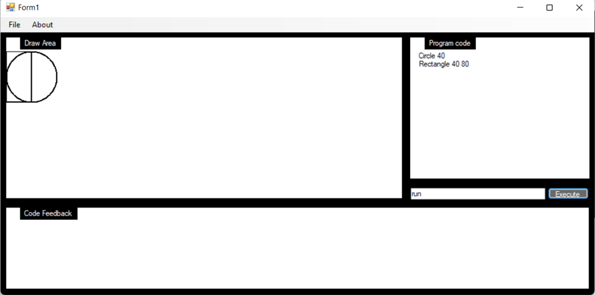
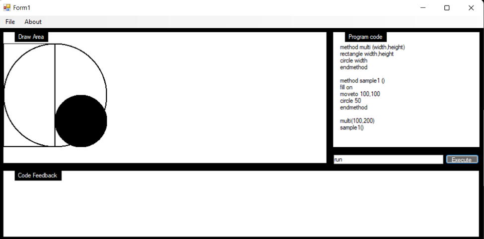
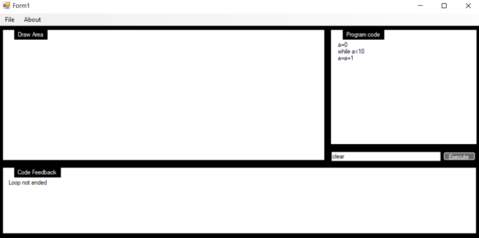

# Graphics Generator

## Project Description
The graphics generator project leverages .NET Framework to create a GUI application that allows the user to use various programming techniques like for loops, if statements, etc to create graphical objects in the application. The application is created using programming techniques that utilizes design patterns and OOP concepts as well as the concept of error handling in OOP environment. It also utilizes the concept of threading to carry out asynchronous operation.

This is a stand-alone application.

## Technology Used

1. .NET Framework for the logic
2. Windows Form for frontend

## Prerequisites

1. Visual Studio with .NET Framework

## Preview

The GUI of the applciation includes Drawing Area, where the pictures are drawn. It includes the Program code area where the code is written and lastly it includes code-feedback area which displays the syntax or logical errors in the code being written by the user.


*fig - GUI of the program*



*fig - More complex code usage*


*fig - Error detection*

## Setting up the application

1. Install Visual Studio.
2. Open project in visual studio with .csproj file.
3. Restore NuGet packages
    ```bash
    dotnet restore
    ```
4. Build the project
    ```
    dotnet build -configuration Release
    ```
5. Run and Debug the process
    ```
    dotnet run
    ```